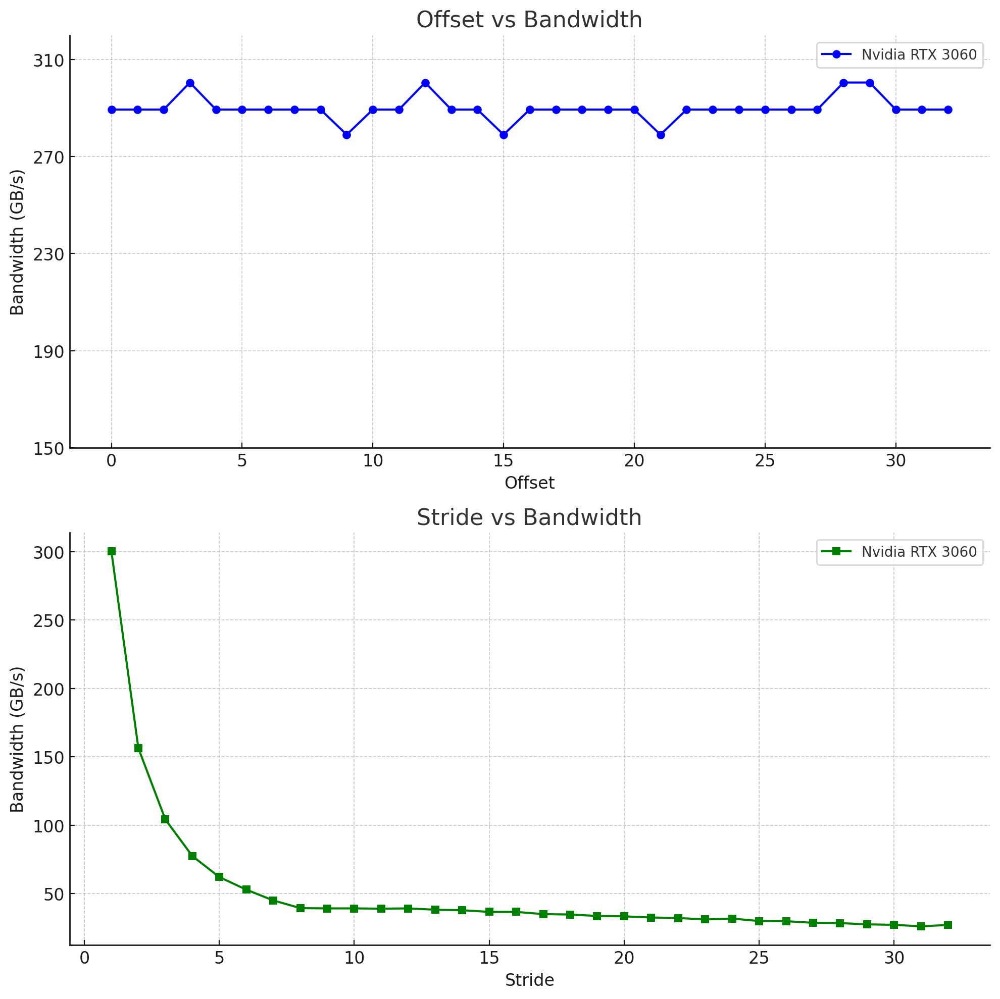

### NOTE

It is advised to read the content in the notes folder before proceeding here to understand what is going under the hood

### Detailed Explanation of the Code:

This code tests the global memory access performance in CUDA using two different techniques: **offset** and **striding**. It measures the **bandwidth** in **GB/s** by performing memory access patterns that access global memory in different ways, and it compares how performance changes with these access patterns.

#### 1. **Helper Function: `cudaCheck()`**

This function is used to handle CUDA errors during memory allocation and kernel execution. It checks if the CUDA function returned a successful result or not. If an error occurs and the program is compiled in debug mode, it prints the error and forces the program to abort using `assert`.

```cpp
inline cudaError_t cudaCheck(cudaError_t result) {
    // Only check errors in debug mode
#if defined (DEBUG) || (_DEBUG)
    if (result != cudaSuccess) {
        fprintf(stderr, "CUDA Compilation Error %s\n", cudaGetErrorString(result));
        assert(result == cudaSuccess);  // If error, assert fails
    }
#endif
    return result;
}
```

-   **Purpose**: This ensures that errors in CUDA API calls (e.g., memory allocation, kernel launches) are checked and handled correctly.
-   **Usage**: It is used after every CUDA function call (such as `cudaMalloc`, `cudaEventCreate`, etc.).

#### 2. **Kernel Functions: `offset()` and `stride()`**

These two kernel functions are used to test memory access patterns and their impact on performance.

-   **`offset()` Kernel**:
    This kernel accesses memory with an offset applied to the thread index, which simulates random memory access patterns. The thread calculates its global index as `blockIdx.x * blockDim.x + threadIdx.x + offset`, where `offset` is the number of elements by which the threads are displaced.

    ```cpp
    __global__ void offset(float *a, int offset) {
        int idx = blockIdx.x * blockDim.x + threadIdx.x + offset;
        a[idx] = a[idx] + 1;
    }
    ```

    -   **Purpose**: To simulate memory access with an offset, which can be a source of non-coalesced memory access patterns, affecting performance.

-   **`stride()` Kernel**:
    This kernel accesses memory with a **stride** applied to the thread index. The global index is calculated as `(blockIdx.x * blockDim.x + threadIdx.x) * stride`, which spreads out the memory accesses more and potentially results in less optimal coalescing.

    ```cpp
    __global__ void stride(float *a, int stride) {
        int idx = (blockIdx.x * blockDim.x + threadIdx.x) * stride;
        a[idx] = a[idx] + 1;
    }
    ```

    -   **Purpose**: To simulate memory access with strides, where the stride is the step between consecutive memory locations accessed by threads.

#### 3. **Main Program Logic**

The program is designed to allocate memory, run the offset and stride kernels multiple times with varying parameters (offsets and strides), and measure the memory access performance.

-   **Memory Allocation**:
    The program allocates memory on the device (GPU) using `cudaMalloc` to store `float` values. The memory size is determined by the number of megabytes (`numMegaBytes = 4`) to allocate. The size of the memory is calculated in terms of the number of elements, and each element is of type `float`.

    ```cpp
    int numMegaBytes = 4;
    int numEle = numMegaBytes * 1024 * 1024 / sizeof(float);
    int size = numEle * sizeof(float);
    cudaMalloc(&a_d, size * 33);
    ```

    -   **Purpose**: Allocates 4 MB of memory on the GPU for the test.

-   **Device Properties**:
    The program retrieves the properties of the GPU using `cudaGetDeviceProperties`, specifically the device name, and prints it. This is useful for knowing which device is being used for the test.

    ```cpp
    cudaDeviceProp prop;
    cudaGetDeviceProperties(&prop, deviceId);
    printf("Device Name: %s\n", prop.name);
    ```

    -   **Purpose**: Displays the name of the device being used (e.g., Tesla T4).

-   **Kernel Execution and Bandwidth Calculation**:
    The program executes the **offset** and **stride** kernels multiple times with varying parameters. Each time, it measures the time taken for the kernel execution using CUDA events (`cudaEventRecord`, `cudaEventElapsedTime`).

    -   **Warm-up Run**: A warm-up run is performed before actual measurement for both the offset and stride kernels.
    -   **Timing**: After resetting the memory (using `cudaMemset`), the kernel is launched, and the time taken for execution is recorded using CUDA events.
    -   **Bandwidth Calculation**: The bandwidth is calculated by dividing the transfer size (in GB) by the time taken (in ms). The formula used is:

        ```
        Bandwidth (GB/s) = (2 * numMegaBytes) / ms
        ```

    -   **Purpose**: To calculate and display the memory bandwidth for different offset and stride values.
    -   This multiplication by 2 is done to account for the fact that the kernel is reading and writing data to the global memory during its execution.
    -   **Reads** the value of a[idx] from global memory.
    -   **Writes** the updated value back to a[idx] in global memory.

```cpp
for (int i = 0; i < 33; i++) {
   cudaMemset(a_d, 0, size);
   cudaEventRecord(startEvent, 0);
   offset<<<numBlocks, blockSize>>>(a_d, i);
   cudaEventRecord(stopEvent, 0);
   cudaEventSynchronize(stopEvent);
   cudaEventElapsedTime(&ms, startEvent, stopEvent);
   printf(" %d, %.2f\n", i, 2 * numMegaBytes / ms);
}
```

-   **Purpose**: To iterate over 33 different offset values and compute the bandwidth for each. The same goes for the other **for** loop where its iterated over 33 different stride values and compute the bandwidth

-   **Cleaning Up**: After the kernel executions, CUDA events and device memory are cleaned up.

```cpp
cudaEventDestroy(startEvent);
cudaEventDestroy(stopEvent);
cudaFree(a_d);
```

-   **Purpose**: Frees the allocated memory and destroys the CUDA events to avoid memory leaks.

#### 4. **Running Code**

```bash
nvcc globalMem.cu -o glomem
./glomem
```

#### 5. **Output**

The output of the program shows the **bandwidth (GB/s)** for different **offset** and **stride** values. Here is an example of the output:

```
Device Name: Tesla T4
Transfer Size (MB): 4
Offset, Bandwidth (GB/s)
  0, 276.85
  1, 274.73
  2, 273.52
  3, 278.40
  ...
Striding
Stride, Bandwidth (GB/s)
  0, 377.07
  1, 277.78
  2, 143.51
  3, 91.98
  ...
```

-   **Offset Bandwidth**: The bandwidth for the offset pattern is relatively high and fairly consistent across the 33 iterations. This is because accessing memory with a small offset does not drastically affect coalescing in global memory.
-   **Stride Bandwidth**: The stride pattern shows a steep decrease in bandwidth as the stride value increases. Large stride values cause threads to access non-contiguous memory locations, resulting in inefficient memory accesses and lower bandwidth.

Plotting these values on a Graph, we get



**Offset Memory Access**

The device coalesces accesses by threads in a warp into as few cache lines as possible, resulting in negligible effect of alignment on throughput for sequential memory accesses across threads. (Checkout Notes for more on Warps)

**Strided Memory Access**

For large strides, the effective bandwidth is poor. This should not be surprising: when concurrent threads simultaneously access memory addresses that are very far apart in physical memory, then there is no chance for the hardware to combine the accesses

**Shared Memory Access**

When accessing multidimensional arrays it is often necessary for threads to index the higher dimensions of the array, so strided access is simply unavoidable. We can handle these cases by using a type of CUDA memory called shared memory. Shared memory is an on-chip memory shared by all threads in a thread block. One use of shared memory is to extract a 2D tile of a multidimensional array from global memory in a coalesced fashion into shared memory, and then have contiguous threads stride through the shared memory tile. Unlike global memory, there is no penalty for strided access of shared memory.

### Conclusion

This code provides a detailed test of how different global memory access patterns (offset vs. stride) impact bandwidth performance on a CUDA-enabled GPU (Tesla T4). It highlights the importance of memory access patterns, as stride-based access can severely degrade performance, especially with larger strides. This behavior is typical of GPUs, where coalesced memory accesses (contiguous or close memory accesses) are much more efficient than non-coalesced ones.

### Note:

-   Striding through global memory is unavoidable in many cases, such as when accessing elements in a multidimensional array along the second and higher dimensions
-   However, it is possible to coalesce memory access in such cases if we use shared memory
