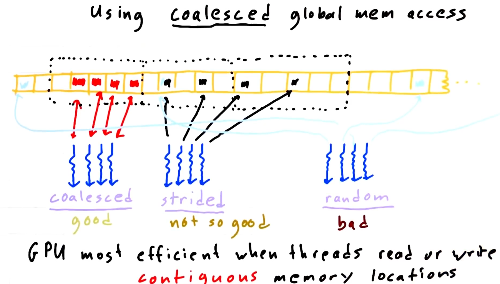

## Global Memory

There are several kinds of memory on a CUDA device, each with different scope, lifetime, and caching behavior. So far in this series we have used global memory, which resides in device DRAM, for transfers between the host and device as well as for the data input to and output from kernels. The name global here refers to scope, as it can be accessed and modified from both the host and the device. Global memory can be declared in global (variable) scope using the `__device__` declaration specifier as in the first line of the following code snippet, or dynamically allocated using `cudaMalloc()` and assigned to a regular C pointer variable as in line 7. Global memory allocations can persist for the lifetime of the application. Depending on the compute capability of the device, global memory may or may not be cached on the chip.

```c
__device__ int globalArray[256];

void foo()
{
    ...
    int *myDeviceMemory = 0;
    cudaError_t result = cudaMalloc(&myDeviceMemory, 256 * sizeof(int));
    ...
}
```

## Intro to Warps

Threads are grouped into thread blocks, which are assigned to multiprocessors on the device. During execution there is a finer grouping of threads into warps. Multiprocessors on the GPU execute instructions for each warp in SIMD (Single Instruction Multiple Data) fashion. The warp size (effectively the SIMD width) of all current CUDA-capable GPUs is 32 threads.

## Global Memory Coalescing

Grouping of threads into warps is not only relevant to computation, but also to global memory accesses. The device coalesces global memory loads and stores issued by threads of a warp into as few transactions as possible to minimize DRAM bandwidth

So, to minimize the time spend on memory access, we coalesce the accesses to global memory




### Left Most Part of 2nd Image

So, whenever a thread (represented by blue squigly line) reads or writes a global memory, it always accesses a large chunk of global memory at once, even if the thread only needs to read / write only a small subset of data in that large chunk. If even the other threads are accessing the memory at the same time, then GPU can exploit that and reuse this larger chunk (dotted rectangular line)

This implies that the GPU is at its most efficient when threads read / write contiguous global memory locations. **Such Access Pattern is called Coalesced**. So in this example, every thread is reading / writing from a chunk of memory thats given by the index of the thread plus some offset, so this coalesced access and is good and we get very high performance on memory read and write in this setting

### Middle Part of 2nd Image

In this scenario, we can see that every adjacent thread (blue squigly line) is accessing every other memory location (that is they are not accessing adjacent memory location). So **this access is not coalesced but strided** (as there is a stride of 2 between every thread access) and this pattern is not so good

This is because, if we consider, five memory locations as a single memory block (represented by black dotted line), then in the first case, for all 4 adjacent threads, we are able to service that with a single memory transaction. Whereas in strided case, we see that we need two memory transactions as we are striding across the memory and thus have two memory blocks/chunks. So, we kinda get half of the speed/bandwidth compared to our previous case.

### Rightmost Part of 2nd Image

The larger the stride, the more is the total memory transactions and lower will be the bandwidth. At a point, we can get to a place where each thread is accessing a spot so far in the memory / so unrelated in memory that every single thread gets its own memory transaction. And this leads to a very bad memory performance. So, for example in the above case, if we increase the stride to 5, then each adjacent thread will access a separate memory block thus leading to 4 memory transactions (1 per thread), thus bad performance

## Conclusion

The global memory will be the fastest when successive threads read/write to the locations in a contigous strech of memory

## References

-   [Coalesce Memory Access - Intro to Parallel Programming](https://www.youtube.com/watch?v=mLxZyWOI340)
-   [Cuda5-Coalesce](https://nichijou.co/cuda5-coalesce/)
-   [Global Memory Coalescing - Medium](https://giahuy04.medium.com/global-memory-coalescing-37a6f9d7e314)
-   [How to Access Global Memory Efficiently? - NVIDIA](https://developer.nvidia.com/blog/how-access-global-memory-efficiently-cuda-c-kernels/)
